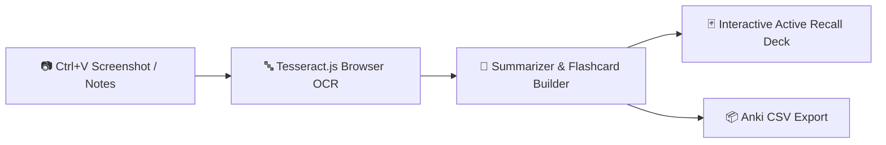

# 🎓 StudyForge & ClipOCR AI

> **Client-Side Screenshot OCR (`Tesseract.js`), Lecture Summarizer & Anki Flashcard Generator.**

```mermaid
flowchart LR
    A["📷 Ctrl+V Screenshot / Notes"] --> B["🔤 Tesseract.js Browser OCR"]
    B --> C["🧠 Summarizer & Flashcard Builder"]
    C --> D["🃏 Interactive Active Recall Deck"]
    C --> E["📦 Anki CSV Export"]
```
